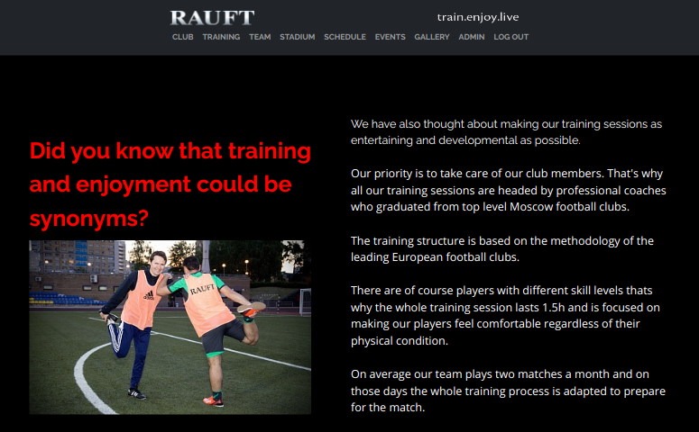
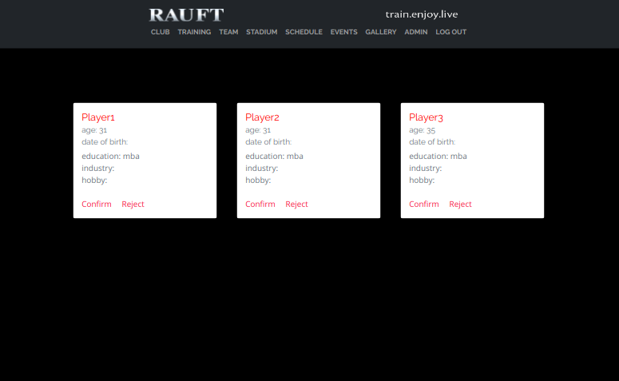

## Веб-сайт для закрытого футбольного клуба [RAUFT](https://rauft.herokuapp.com/training)
Цель данного проекта - реализовать веб-сайт для футбольного клуба с целью публикации актуального расписания тренировок и фотоматериалов с совместных мероприятий. Так же реализована страничка админа сайта для валидации новых пользователей.

  

# Функционал
Регистрация и авторизация пользователей через cookie и сессии. Хранение сессий пользователей в БД и хэширование паролей с помощью bcrypt. Предусмотрено разделение ролей: админ, пользователь, кандидат в пользователи.
Реализована админ-панель, где админ может одобрить или отклонить заявки на добавление в списки пользователей.

  

# Планы
1. Реализовать разграничение доступов к материалам сайта для пользователей с разными ролями.
2. Реализовать интеграцию с Google-календарем заказчика для удобства назначения даты и времени тренировок.
3. Добавить карточки с подробной информацией о кандидатах в пользователи.
